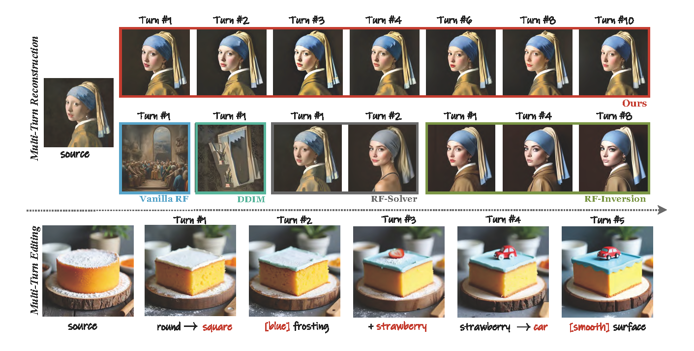

# [Multi-turn Consistent Image Editing] ICCV 2025

[](https://www.arxiv.org/abs/2505.04320)
[](https://zhouzj-dl.github.io/Multi-turn_Consistent_Image_Editing/)
<!--[]()[deploying]-->

*A multi-turn image editing framework is proposed that leverages flow matching inversion and a dual-objective guided sampling process to preserve the underlying image distribution across successive edits.*
<!-- [](link/to/your/huggingface_space) -->

---

## 📰 News

<!--*   **[2025-04-26]:** Preprint submitted to arXiv.-->

<!--*   **[2025-04-26]:** Online Gradio demo launched. -->
*   **[2025-03-08]:** Paper submitted to [ICCV/2025].

## ✨ 0. Preview

*Multi-turn Image Reconstruction & Editing*



Recognizing that many recent image editing methods are limited to single-turn operations, we propose a multi-turn image editing framework. 
Our method leverages flow-inversion for rapid and accurate initial results and employs LQR guidance (as seen in RF-Inversion) to maintain image distribution.
By combining these techniques, our framework achieves high reconstruction accuracy within multi steps while providing a stable and continuous editing workflow that allows users to gradually refine their image interactively.

## 🔧 1. Requirements

*   Python
*   PyTorch
*   Gradio

You can install the required packages using pip:

```bash
conda create -n MTC_edit python=3.12
conda activate MTC_edit     

# clone the repository
git https://github.com/ZhouZJ-DL/Multi-turn_Consistent_Image_Editing.git
cd Multi-turn_Consistent_Image_Editing

# install the required packages
pip install -r requirements.txt
```

## 🎛️ 2. Gradio Demo Usage
Try our demo directly on HuggingFace Space [Deploying now]
[]()

Or

Run the Gradio demo locally:
```bash
python gradio_demo_playground.py
```
Then open your browser at http://localhost:7860.

## 📊 3. Test Code Usage

### 3.1 Command Line Usage
```bash
python test_batch.py
```
### 3.2 Core Code
Our method centers on image inversion and sampling across multiple turns. We provide implementations of several flow-based and inversion-based image editing baselines ([RF-Solver](), [FireFlow]() and [RF-Inversion]()), alongside our dual-objective LQR sampling approach.

The implementation of these methods and ours can be found in the code within [src/flux/sampling.py]().
```python
def denoise_rf():
    # vanilla rf
    # ...

def denoise_rf_solver():
    # RF-Solver
    # ...

def denoise_fireflow():
    # FireFlow
    # ...

def denoise_rf_inversion():
    # RF-Inversion
    # ...

def denoise_multi_turn_consistent():
    # Ours MTC: Multi-turn Consisitent Image Editing
    # ...
```


## 🔄 4. Multi-Turn Dataset
Currently, there is no existing public dataset specifically designed for multi-turn image editing. To address this gap, we constructed a new multi-turn dataset. To ensure consistency with existing single-turn image editing benchmarks and facilitate fairer comparisons, we chose to expand upon the established [PIE-Bench](https://github.com/cure-lab/PnPInversion) dataset .

The original PIE-Bench dataset comprises 700 images, categorized by 10 types of edits: (0) random editing, (1) change object, (2) add object, (3) delete object, (4) change something's content, (5) change something's pose, (6) change something's color, (7) change something's material, (8) change image background, and (9) change image style. For each image, the dataset provides the original descriptive prompt and a single editing prompt corresponding to one of these types.

To create our multi-turn extension, we utilized Large Language Models (LLMs). For each PIE-Bench sample, we used the original prompt and the provided (first-turn) editing prompt as input to an LLM. The LLM was tasked with generating four subsequent editing prompts, creating a five-turn sequence (original edit + 4 generated edits). A key constraint during generation was that each successive prompt had to correspond to a distinct editing type from the predefined categories, ensuring variety across the editing sequence.

The data structure should be like:
```python
|-- MTC_prompts
# each image in PIE-Bench according to a editing sequence, saved in a yaml file
    |-- 000000000000
        |-- 000000000000.yaml
            |-- image_path: 0_random_140/000000000000.jpg
            |-- original_prompt: a slanted mountain bicycle...
            |-- instructions:
                |-- Round 1:
                    |--editing_instruction: ...
                    |--editing_type_id: '0'
                |-- Round 2:
                    |--editing_instruction: ...
                    |--editing_type_id: '4'
                |-- Round 3:
                    |--editing_instruction: ...
                    |--editing_type_id: '7'
                |-- Round 4:
                    |--editing_instruction: ...
                    |--editing_type_id: '8'
    |-- 000000000001
        |-- 000000000001.yaml
            |-- image_path: 0_random_140/000000000000.jpg
        ...
```

## 💖 5. Acknowledgements 
We sincerely thank the teams behind [FLUX](https://github.com/black-forest-labs/flux) and [FireFlow](https://github.com/HolmesShuan/FireFlow-Fast-Inversion-of-Rectified-Flow-for-Image-Semantic-Editing) for their well-organized and accessible codebases. Their contributions make it easier for the community to explore and advance interactive image editing.